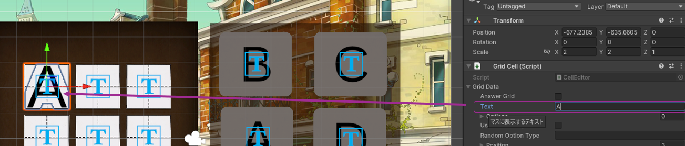

# 【開発者向け】問題制作ツール 問題データ制作の手引き
## Ver 2024.09.11版

このドキュメントは、問題データを制作する際、開発者ツールを利用した制作手順を記すものです。

各種問題データ定義については、別紙[問題データリファレンス](TODO:リンク付け)を参照してください。※作成中


## 目次

- [1. 開発者ツールの起動方法](#1-開発者ツールの起動方法)
- [2. 大問情報の入力](#2-大問情報の入力)
  - [テンプレート番号とエディタの対応](#テンプレート番号とエディタの対応)
- [3. 小問制作](#3-小問制作)
  - [3-1. 4択式問題制作エディタ](#3-1-4択式問題制作エディタ)
    - [グリッドの生成](#グリッドの生成)
    - [マスの編集（問題設計）](#マスの編集問題設計)
    - [マスに文字を表示する](#マスに文字を表示する)
    - [ユーザーに解答させたいマスの場合](#ユーザーに解答させたいマスの場合)
    - [任意のイラストを表示させる](#任意のイラストを表示させる)
  - [3-2. カード式問題制作エディタ](#3-2-カード式問題制作エディタ)
    - [問題タイプについて](#問題タイプについて)
    - [配置するカードの行数と列数を指定する](#配置するカードの行数と列数を指定する)
    - [表示するカードの種類を設定する](#表示するカードの種類を設定する)
    - [プレビュー表示する](#プレビュー表示する)
  - [3-3. クリック式問題制作エディタ](#3-3-クリック式問題制作エディタ)
    - [問題画像を設定する](#問題画像を設定する)
    - [クリックさせたい領域を指定する](#クリックさせたい領域を指定する)
- [4. 問題データの出力](#4-問題データの出力)
  - [問題（小問）を追加したい時](#問題小問を追加したい時)
  - [新しく大問を制作する時](#新しく大問を制作する時)


# 1. 開発者ツールの起動方法
本Unityプロジェクトを開いた際に、上部ツールバーにある`開発ツール > 問題制作ツール`を選択してください。


起動すると、以下の様に大問制作画面が表示されます。


# 2. 大問情報の入力
以下それぞれの情報を`問題制作ツールウィンドウ`に入力していきます。
- 問題タイトル：ゲーム開始時, ポーズ画面において表示される問題タイトル
- 問題文 : 〃に表示される問題説明文
- 制限時間：各問の制限時間を定義します。
- テンプレートタイプ：使用する問題のテンプレート番号を指定します。
    - 2024.08.08現在は`1～5`までのテンプレートを指定できます。

## テンプレート番号とエディタの対応
以下の番号指定により、使用するエディタが自動選択されます。
- 1 or 2 or 3
    - 4択式問題制作エディタ
- 4           
    - カード式問題制作エディタ
- 5           
    - クリック式問題制作エディタ

入力が終わったら`この条件で問題を作成する`を選択し、小問作成エディタへ遷移します。

# 3. 小問制作
小問制作エディタは、以下の3タイプに分かれています。
- 4択問題制作用
- カード式問題制作用
- クリック式問題制作用

以下それぞれのエディタに関する説明を記載します。

## 3-1. 4択式問題制作エディタ
起動すると以下のような画面が表示されます。


このエディタでは、次のようなパターンの問題を作成することができます。
1. 熟語問題、虫食い穴埋め問題
2. クロスワードパズル
3. その他イラスト等を見て、文字や数字を解答する問題

### グリッドの生成
問題用のグリッド（マス）を生成するには、`GirdEditor`のインスペクタにある以下の項目を指定し、`グリッド再生成`を押下してください。


### マスの編集（問題設計）
生成した各マスを編集するには、[ヒエラルキー](https://shibuya24.info/entry/unity-editor-hierarchy)から`Grids以下のオブジェクト`を選択してください。
- `Cell Prefab`に指定した素材のマスが生成されます。(任意のPrefabをマスにすることが可能)
- 既定では、`SampleCell`という名前のオブジェクト（マス）が複数生成されます。


各マスには`Grod Cell`というコンポーネントがアタッチされているので、インスペクタから、必要な情報を入力することで問題を作成していきます。


#### マスに文字を表示する
`Text`の欄に任意の文字を入れると、そのマスに表示する文字を指定できます。入力すると、プレビューされます。



#### ユーザーに解答させたいマスの場合
`Answer Grid`に✅を入れます。※クリックしてください。

上記が有効になっているマスは、`解答用マス`として扱われます。
解答用マスで指定できる属性は以下の通りです。
```
- Options（選択肢の情報）
    - Text    ：選択肢に表示するテキスト
    - Correct ：正解の選択肢かどうか（1つのみ✅）

- Use Random Option  : 正解以外の3つの選択肢をランダム生成するか否か。 
- Random Option Type : ランダム生成する選択肢のタイプ
    /** 生成可能なタイプ
        - kanji : 漢字
        - hira  : ひらがな
        - kata  : カタカナ
        - int   : 整数
    */
```


#### 任意のイラストを表示させる。
このエディタでは、任意のイラストや画像1枚を問題表示エリアに表示させることができます。

- Ex.) イラストを見て解答する問題、商品の代金計算、時計を見て時刻を答える ...

問題にイラストを用いたい場合は、`Grid Editor`のインスペクタから、`Question Image`を設定します。

1. Unityの[Assetフォルダ内に、表示したい画像をインポート](https://cgbox.jp/2023/06/20/unity-gazou/#index_id0)します。

2. `Question Image`の入力欄を選択し、表示したい画像を一覧から探して選択します。


## 3-2 カード式問題制作エディタ
- 対応する問題パターン
    - 神経衰弱
    - カード式の間違い探し


### 問題タイプについて
このエディタでは、２つのタイプの問題を制作することができます。
- `Pair`タイプ
    - 神経衰弱の様に、2枚以上の同種類のカードを選んで正解とする問題
    - 何枚のペアが必要かは`Pair Count`で設定します。
- `Single`タイプ
    - ある特定のカードを1枚みつけるような問題
    - カード型の間違い探しでの使用を想定します。


### 配置するカードの行数と列数を指定する。
`Card Editor`のインスペクタから以下の項目を指定します。
```
- Row Size    : 配置するカードの行数
- Column Size : 配置するカードの列数
- Margin      : カード間の間隔
```
例えば、縦 3行 横 3行でカードを配置したい場合、
```
- Row Size    : 3
- Column Size : 3
```
で指定します。

なお、`各カードの位置は実際のゲームプレイ上では、ゲーム性を考慮しランダムに決定`されます。

指定できるのは以下の項目のみです。
- 行数
- 列数
- カード間の間隔
- 表示枚数

### 表示するカードの種類を設定する。
`Card Editor`のインスペクタから`Cards`に必要な種類分だけカード情報を定義します。


### プレビュー表示する。
`カード再生成`を押下すると、シーンエディタ上にプレビュー表示されます。


## 3-3 クリック式問題制作エディタ
画像上のクリックエリアを指定して解答する問題を制作します。
- 対応する問題パターン
    - 2画像間の間違い探し


### 問題画像を設定する。
左右の画像表示領域に対して、それぞれの画像を設定することができます。


### クリックさせたい領域を指定する。
画像を設定したら、ユーザーにクリックさせたい領域を指定します。

インスペクタから、`「＋」or 「ポイントを追加」`を押すと、以下の様に領域を示す`赤い四角形`がシーンエディタ上に表示されます。

- 位置を変える
    - シーンエディタ上に表示されている、矢印を選択し座標を決定します。
- 大きさを変える
    - 四角形の右下をドラッグすることで、動的に領域のサイズを指定します。


# 4. 問題データの出力
各エディタのインスペクタにある、`小問を作成する`ボタンを押下します。

完了後、ログに以下の様な表示がでます。


既定では以下の階層ディレクトリに問題データが出力されます。
- 大問構成ファイル : `Assets/StreamingAssets/QuestionData/<画面タイプ番号>`
- 小問構成ファイル : `Assets/StreamingAssets/QuestionData/<画面タイプ番号>/quiz`

## 問題（小問）を追加したい時
同じような問題で、違うパターンの問題を続けて作成するには、各Editorに表示されている`クリアボタン`を押下し、設定内容をリセットしてください。

そして、手順3から繰り返すことで、あたらしい小問を作成することができます。
※所属する大問は同じ

## 新しく大問を制作する時
別の大問として作り直したいときは、手順１よりやり直します。
※上部ツールバーにある`開発ツール > 問題制作ツール`を選択してください。