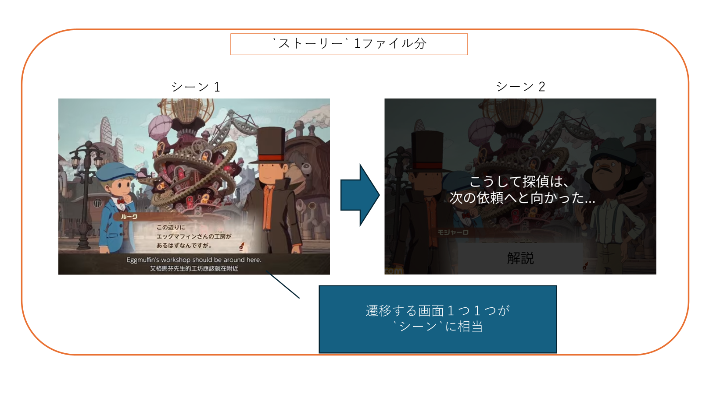
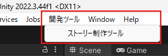
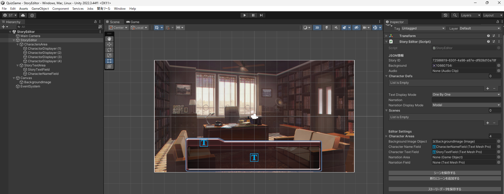
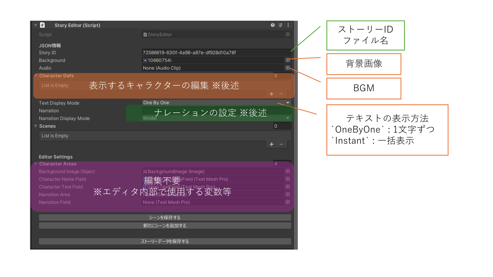
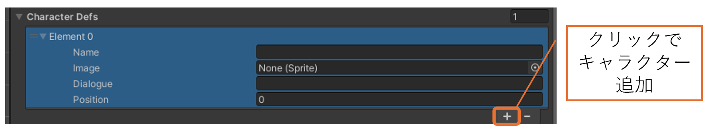

# [開発者向け] ストーリーデータ作成ツール
## Ver 2024.09.11版

このドキュメントは、ストーリーデータを制作する際、開発者ツールを利用した制作手順を記すものです。

データ型定義・インタフェースについては、別紙[ストーリーデータデータリファレンス](TODO:リンク付け)を参照してください。※作成中

## 目次


# 用語と構造の確認
- `ストーリー` : 作成したいストーリーの単位。複数の`シーン`から構成される。1ファイルに1つのストーリーを記述する。
  - 1つの大問につき1つの`ストーリー`を持つ想定。
  
- `シーン` : ストーリーの中での1つの場面を示す単位、`ストーリー`を構成する最小単位。
  - 表示画面１つ分の情報を持つ。
  - 表示する背景画像
  - 表示するキャラクターの情報（イラスト, セリフ ...）
  - その画面で流す音声データ(SE)

エディタは、このシーンを１枚づつ制作し、全体をまとめてストーリーデータとして出力することができます。



# 1. 開発者ツールの起動方法
本Unityプロジェクトを開いた際に、上部ツールバーにある`開発ツール > ストーリー制作ツール`を選択してください。



起動すると、以下の様にストーリー制作画面が表示されます。



# 2. ストーリーデータの作成
データの作成はヒエラルキー上にある`StoryEditor`オブジェクトを選択、そのインスペクタ上にアタッチされている`StoryEditor (Script)`に値入力していくことで作成を行います。



## 背景画像とBGMの設定
- 背景画像
  1. Unityの[Assetフォルダ内に、表示したい画像をインポート](https://cgbox.jp/2023/06/20/unity-gazou/#index_id0)します。
  2. `StoryEditor`の`Background`にインポートした画像をアタッチします。
- BGM
  1. Unityの[Assetフォルダ内に、再生したい音楽ファイルをインポート](https://hitomana-game.com/2022/08/12/unitybgm%E3%81%AE%E4%BB%98%E3%81%91%E6%96%B9%E3%83%BB%E8%A8%AD%E5%AE%9A%E6%96%B9%E6%B3%95/#toc4)します。
  2. `StoryEditor`の`Audio`にインポートした音楽ファイルをアタッチします。

## キャラクターの設定
キャラクターの設定は、`StoryEditor`の`Character`にある`CharacterList`に、表示したいキャラクターの情報を追加していくことで行います。

### キャラクターを追加する。
1. `CharacterDefs`にある『＋』を選択肢、新しいキャラクターを追加することができます。
   
2. 追加された要素に以下の情報を入力していきます。
```
- Name : キャラクターの名前
- Image : 表示する素材画像
- Dialogue : キャラクターのセリフ
- Position : キャラクターの表示位置
```

## ナレーション用のシーンを作成する。
ナレーション用のシーンを作成する場合、`Narration`と`Narration Display Mode`を設定します。
```
- Narration : 表示するナレーション文
- Narration Display Mode : ナレーションの表示方法を設定します。
  - Modal : 画面全体を黒色背景で透過し、中央にナレーションを表示する方式。
    - Tips : ストーリーの最後などで使います。
  - Inline : 通常のキャラクターのセリフ領域にナレーションを表示する方式。
    - Tips : ストーリー進行中、情景描写などを表示したいときに使います。
  - None : ナレーションを使用しない時に選択。
```
# 3. シーンの保存

シーンを保存するには、`StoryEditor`下部にある、`シーンを保存する`ボタンを選択してください。

このボタンを押すことで、作成したシーン情報が一時保存され、新しいシーンを作成することができます。


# 4. ストーリーデータの出力

シーンの作成・保存が完了したら、ストーリーデータの出力を行います。

`StoryEditor`下部にある、`ストーリーデータを保存する`ボタンを選択してください。

既定では、以下のディレクトリにストーリーデータが出力されます。
```
Assets/StreamingAssets/StoryData/<StoryIdの値>.json
```
