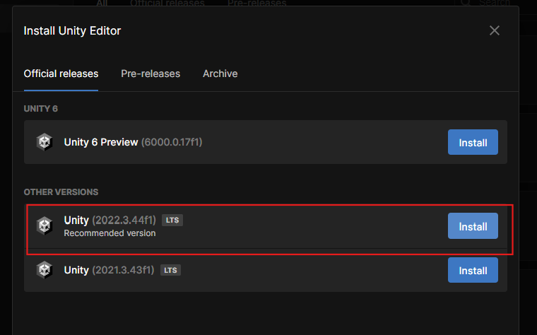
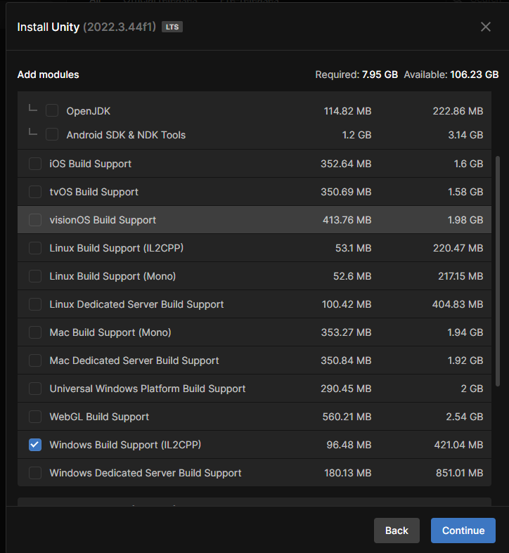
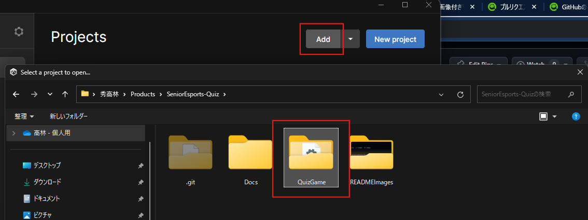
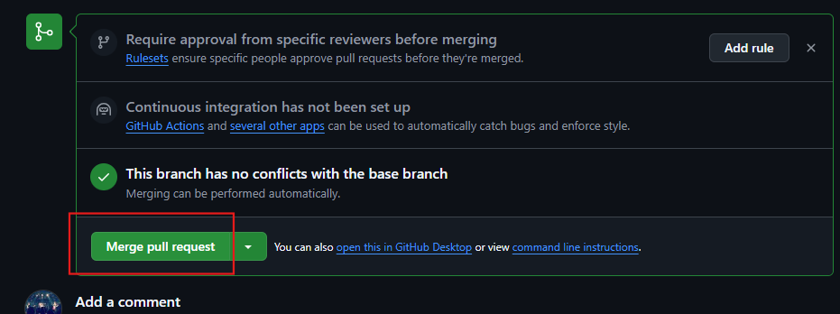
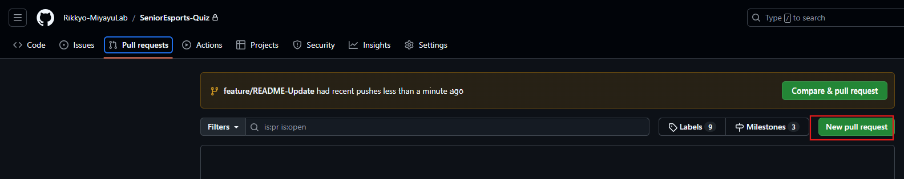
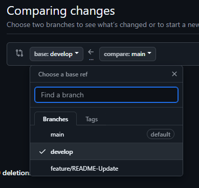
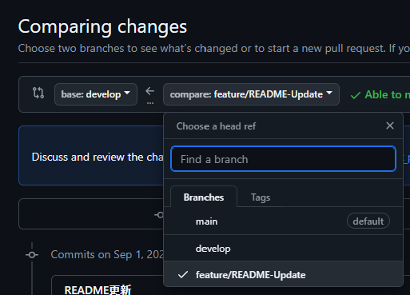
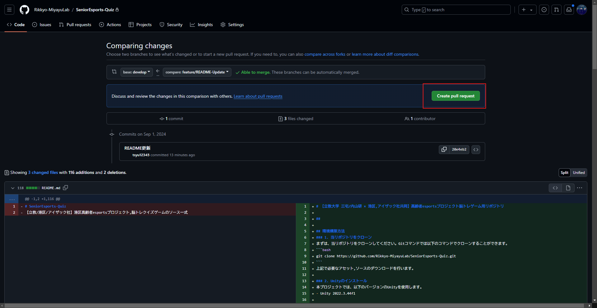
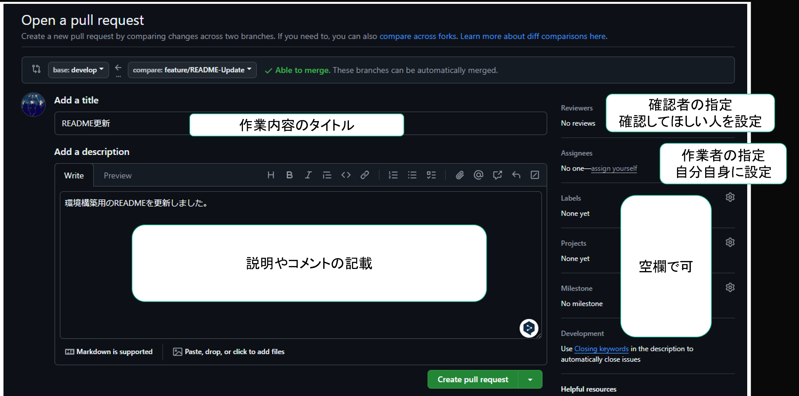
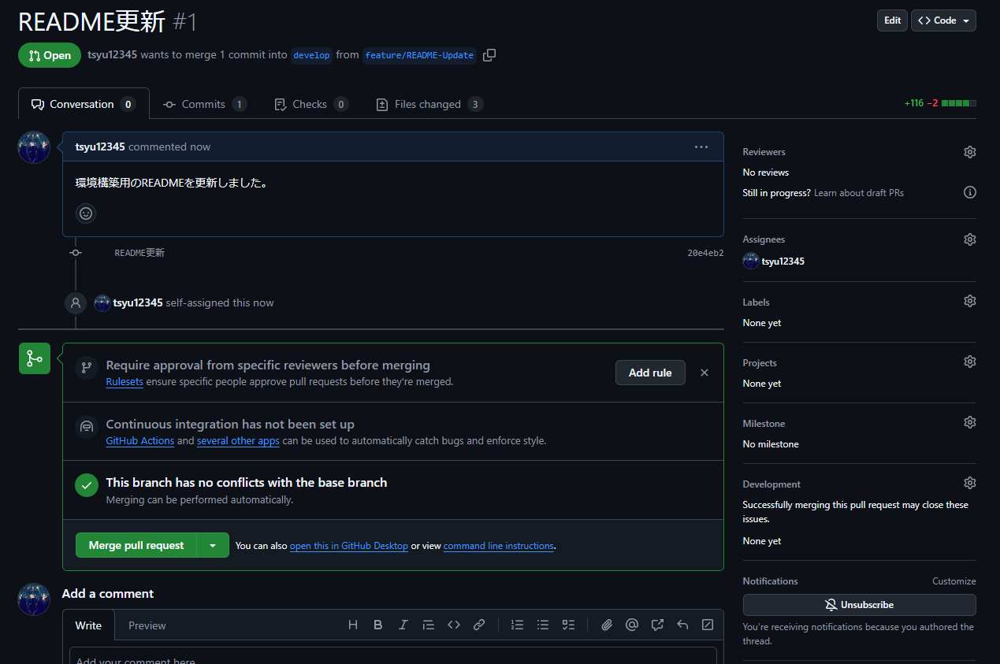

# 【立教大学 三宅/内山研 × 港区,アイザック社共同】高齢者esportsプロジェクト脳トレゲーム用リポジトリ

## 環境構築方法
### 1. 当リポジトリをクローン
まずは、当リポジトリをクローンしてください。Gitコマンドでは以下のコマンドでクローンすることができます。
```bash
git clone https://github.com/Rikkyo-MiyayuLab/SeniorEsports-Quiz.git
```
上記で必要なアセット,ソースのダウンロードを行います。

クローン後は、以下のようなディレクトリ構成になります。
```bash
./
├── README.md (本ファイル)
├── READMEImages (READMEで使用する画像ファイル)
└── QuizGame ← 本プロジェクトで使用するUnityプロジェクト本体
    ├── Assets←
    ├── Packages
    ├── ProjectSettings
    ├── .gitignore
```

### 2. Unityのインストール
本プロジェクトでは、以下のバージョンのUnityを使用します。
- Unity 2022.3.44f1

インストールはUnityHubから行えます。



#### 2-1.プラットフォームの選択
リリース時に実行ファイルにビルドする必要があるため、Windows Build Supportをインストールしておく必要があります。
インストール時には、`Windows Build Support`にチェックを入れて下さい。



### 3. Unityプロジェクトを開く
クローンしたリポジトリにある`./QuizGame`をUnityHubから開いてください。


以上で環境構築は完了です。開発を始める準備が整いました。


## ブランチ運用について
ブランチ運用については、『`develop`を筆頭に作業用ブランチ`featureブランチ`を各々が作成して、マージする形式』とします。
`develop`へのマージの際には、GitHub上で[`PullRequest`](https://backlog.com/ja/git-tutorial/pull-request/01/)を作成し、`双方向で確認`をとれるようにします。

実際の作業手順とブランチ運用については後述します。

| ブランチ名 | 役割 |
| --- | --- |
| `main` | - 安定版のリリースブランチ。<br>- リリース時にはこのブランチを使用します。<br>- 一通り開発が終了し、問題なくある程度ゲームプレイを行うことのできる状態(デプロイ可能)なブランチ。 |
| `develop` | - 開発用ブランチ。<br>- 各機能開発後はこのブランチにマージしていきます。(各作業ブランチからのマージを受けるブランチ。)<br>- このブランチでリリースを行える状態になったら、`main`ブランチにマージします。 |
| `feature/<任意のブランチ名>` | - 作業用ブランチ。<br>- 最新状態の`develop`からチェックアウトしてこのブランチを作成し、実際の作業を行います。<br>- 作業終了後、適当なタイミングでこのブランチに`コミット & プッシュ`を行います。 |
  
## 実際の作業手順

### 1. `develop`を最新の状態に更新。
```bash
# developブランチにチェックアウト
# git checkout develop
git pull origin develop
```
### 2. 作業用ブランチを作成し切り替える。
```bash
git checkout -b feature/<任意のブランチ名>
# 例: git checkout -b feature/PlayScene-Type1

## ☝は下記を同時実行しています。
# git branch 新しいブランチ名
# git checkout 新しいブランチ名
```
### 3. 作業を開始する。
作業を行います。バグが出たらレベルアップのチャンス！

### 4. 作業用ブランチにコミットする。
適当な区切りで作業が完了したら、コミットを行います。
```bash
# コミットするファイルを選択
git add <ファイルパス> 
## 例: git add Assets/Scenes/PlaySceneType1.unity
# 変更したファイルすべてを選択する場合：git add .

# 変更をコミット
git commit -m "コミットメッセージ"
```
### 5. 作業用ブランチをリモートリポジトリにプッシュする。
適当なタイミングで、作業用ブランチの内容をリモートリポジトリにプッシュしてください。
```bash
git push
```

### 6. （作業完了後）`PullRequest`を作成する。
開発が完了したら、GitHub上で`PullRequest`を作成してください。
`PullRequest`を作成する際には、`develop`ブランチに対して作成してください。

※ `PullRequest`の作成方法については、後述します。


## `PullRequest`を`develop`にマージする。
### 1. 当該のPullRequestの内容を確認する。
GitHubのページにアクセスし、`PullRequest`の内容を確認してください。
- `PullRequest`が作成されると、Slack上で通知が届きます。
- また、GitHubの通知でも確認することができます。
  

### 2. 動作確認を行う。
`PullRequest`の内容の動作確認を行います。以下のコマンドで、`PullRequest`の内容をローカルに反映させることができます。
1. `PullRequest`をローカルに取得
```bash
git fetch origin pull/<PRのID>/head:<任意のブランチ名>
# 例
## PR番号: #30
## git fetch origin pull/30/head:pr-30
```
2. 取得したブランチにチェックアウト
```bash
git checkout <1.で指定したブランチ名>
# 例 git checkout pr-30
```

### 3. 動作確認が完了したら、`PullRequest`をマージする。
この時、動作に問題がある等の場合は、`PullRequest`のページにコメントを残すか、担当者にSlackで連絡をとってください。

問題が無ければ、`PullRequest`承認し、`develop`へのマージを行います。
この時、`develop`へのマージはGitHub側で自動的に行うので問題ありません。
※下図赤枠を選択します。
    


## `PullRequest`の作成方法
作業が完了し、作業内容を作業用ブランチにコミット & プッシュしたら、以下の手順で`PullRequest`を作成できます。

### 1. GitHubのページにアクセス
[Pull requests](https://github.com/Rikkyo-MiyayuLab/SeniorEsports-Quiz/pulls)のページに飛び、右側上部にある`New pull request`をクリックします。
※下図赤枠部

    

### 2. `base`と`compare`を設定
- `base`には、マージ先のブランチを選択します。`develop`を選択します。
- `compare`には、マージ元のブランチを選択します。該当する作業用ブランチを選択します。

- 例：作業用ブランチ名「`feature/README-Update`」の場合
  
    <p align="left">
        
        
    </p>

### 3. `PullRequest`を投稿する。
1. コミット内容が表示されるので、問題なければ`Create pull request`をクリックします。
※下図赤枠部



2. `Open a pull request`という画面が表示されるので、フォームに`PullRequest`の内容を記載していきます。
   
   

最後に、`Create pull request`をクリックして投稿します。

### 4. 投稿完了
投稿が完了すると、以下の様に`PullRequest`が作成されます。



以上で一連の作業手順は完了です。
これを機能単位毎に繰り返していきます。


  
